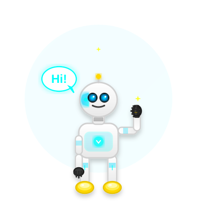

<!-- Cybersecurity Banner -->

  

 

<!-- Custom Header -->

  <table border="0" cellpadding="0" cellspacing="0" align="center">
    <tr>
      <td align="center" valign="middle">
        
        
      </td>
    </tr>
  </table>

<!-- Hello Section (Quantum3600 Style) -->
<!-- Hello Section (Quantum3600 Style) -->

  
   
  <h1> 𝐇𝐞𝐥𝐥𝐨,  </h1>
  
  <a href="https://git.io/typing-svg">
    !" alt="Typing SVG" />
  </a>
  
   
  

  <h3 style="font-size: 22px; color: #ffffff; line-height: 1.8; margin: 20px 0;">
    A budding <b style="color: #00FFFB;">Cybersecurity Analyst</b> and <b style="color: #00FFFB;">Web Defender</b> 🛡️ from <a href="https://hetc.ac.in/" style="color: #0575e6; text-decoration: none;">Hooghly Engineering & Technology College, West Bengal</a>, 
    who is obsessed with securing the digital frontier and wants a platform to protect and excel 🚀.
      
    <i style="font-size: 18px; color: #00f260;">"Breaking codes while <b>BUILDING & SECURING</b>!!!"</i>
  </h3>

  

 

---

<!-- GitHub Stats Section - Quantum3600 Style -->
<h2 align="center">📊 GitHub Stats</h2>

  <table>
    <tr>
      <td width="35%" valign="top">
        <h3 style="color: #ff6b6b;">Soumya-420</h3>
        

          🔹 <b>60 Contributions in 2025</b> 
          📦 <b>3 Public Repos</b> 
          🕐 <b>Joined GitHub 8 months ago</b>
        

      </td>
      <td width="65%" valign="top">
        
<i>contributions in the last year</i>

        
      </td>
    </tr>
  </table>

 

  <table>
    <tr>
      <td width="50%" align="center">
        <h3 style="color: #ff6b6b;">Top Languages by Repo</h3>
        
      </td>
      <td width="50%" align="center">
        <h3 style="color: #ff6b6b;">Guardian Bot</h3>
        
      </td>
    </tr>
  </table>

---

<!-- Badges: Status & Socials -->

  
  

 

---

<!-- Skills Section -->
<h2 align="center">🛠️ Tech Arsenal</h2>

  <table>
    <tr>
      <td align="center" width="33%"><b>Languages</b></td>
      <td align="center" width="33%"><b>Frontend</b></td>
      <td align="center" width="33%"><b>Security & Tools</b></td>
    </tr>
    <tr>
      <td align="center">
        
      </td>
      <td align="center">
        
      </td>
      <td align="center">
        
      </td>
    </tr>
  </table>

---

<!-- Snake Animation -->
<h2 align="center">🐍 Contribution Snake</h2>

  <picture>
    <source media="(prefers-color-scheme: dark)" srcset="https://raw.githubusercontent.com/Soumya-420/Soumya-420/output/github-contribution-grid-snake-dark.svg">
    <source media="(prefers-color-scheme: light)" srcset="https://raw.githubusercontent.com/Soumya-420/Soumya-420/output/github-contribution-grid-snake.svg">
    
  </picture>

 

<!-- Contact Me Section -->
<h2 align="center">🤝 Contact Me</h2>

  
  
  
  

 

<h3 align="left">✍️ Get Motivated, Guys:</h3>

  <table border="0">
    <tr>
      <td width="60%" align="center" valign="middle" style="background-color: #0d1117; border-radius: 10px; padding: 20px;">
        <h3 style="color: #00FFFB;">
          <i>"Humans are the weakest link in any security chain."</i>
        </h3>
        
- Kevin Mitnick

      </td>
      <td width="40%" align="center" valign="middle">
        
      </td>
    </tr>
  </table>

---

<!-- Footer -->

  

